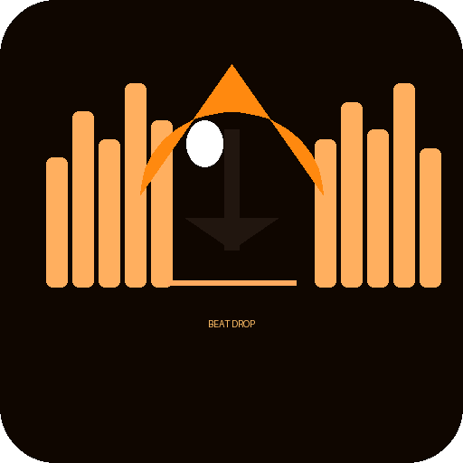

# ◈ Beat Drop — Music Downloader

<p align="center">
  
</p>

<p align="center">
  <b>No ads. No viruses. No sketchy websites. Just music.</b><br/>
  A clean GUI music downloader built with Python — runs 100% locally on your machine.
</p>

<p align="center">
  
  
  
  
</p>

---

## The Problem

Every time I wanted to download a Punjabi track or any song, the process was the same.

Open a random website → Fight through 10 popups → Click the wrong button → Get redirected to something sketchy → Waste 15 minutes → Still no song.

So I built Beat Drop. One app. No browser. No nonsense.

---

## Features

- Search songs by name or artist across **YouTube, YouTube Music, JioSaavn and SoundCloud**
- Download as **MP3 (320kbps / 192kbps / 128kbps)**, M4A, FLAC, or WAV
- **Live progress bar** with speed and ETA display
- **Download history** — remembers what you downloaded so you never duplicate
- **Source switcher** — switch between platforms with one click
- **Folder chooser** — save music anywhere you want
- Works on **Linux, Windows 10/11 and macOS**
- Zero ads. Zero telemetry. Fully offline after install.

---

## Built With

| Tool | Purpose |
|---|---|
| Python 3 | Core application |
| Tkinter | GUI interface |
| yt-dlp | Download engine |
| ffmpeg | Audio conversion |

---

## Installation

### Step 1 — Clone the repo

```bash
git clone https://github.com/yuvrajsinghrangi/beat-drop.git
cd beat-drop
```

### Step 2 — Install Python dependencies

**On Linux / Parrot OS / Kali / Ubuntu:**
```bash
pip install yt-dlp --break-system-packages
```

**On Windows:**
```bash
pip install yt-dlp
```

### Step 3 — Install ffmpeg

**Linux:**
```bash
sudo apt install ffmpeg -y
```

**Windows:**
1. Download ffmpeg from https://ffmpeg.org/download.html
2. Extract the zip
3. Copy `ffmpeg.exe` into the same folder as `music_downloader.py`
   OR add it to your system PATH

### Step 4 — Run the app

```bash
python3 music_downloader.py
```

---

## How to Use

1. Type a song name or artist name in the search box
2. Select your source — YouTube, YouTube Music, JioSaavn or SoundCloud
3. Hit **SEARCH** or press Enter
4. Click a result from the list
5. Set your quality and format in the right panel
6. Click **⬇ DOWNLOAD SELECTED**
7. Find your file in the Music folder (or wherever you chose)

---

## Making an EXE for Windows

Want to share Beat Drop with someone who does not have Python installed?
Use **PyInstaller** to package it into a single `.exe` file.

### Step 1 — Install PyInstaller

Open Command Prompt and run:
```bash
pip install pyinstaller
```

### Step 2 — Make sure ffmpeg.exe is in the project folder

Download `ffmpeg.exe` from https://ffmpeg.org/download.html and place it
in the same folder as `music_downloader.py`.

### Step 3 — Build the EXE

```bash
pyinstaller --onefile --windowed --icon=assets/beat_drop.ico --add-binary "ffmpeg.exe;." --name "BeatDrop" music_downloader.py
```

What each flag does:

| Flag | Meaning |
|---|---|
| `--onefile` | Packs everything into a single .exe file |
| `--windowed` | No black terminal window behind the GUI |
| `--icon` | Sets the app icon to your beat_drop.ico |
| `--add-binary` | Bundles ffmpeg.exe inside the exe |
| `--name` | Names the output file BeatDrop.exe |

### Step 4 — Find your EXE

After the build finishes, look inside the `dist` folder:
```
beat-drop/
  dist/
    BeatDrop.exe   ← this is your file
```

Double click `BeatDrop.exe` — no Python needed, no installation needed.
Share it with anyone on Windows.

### Notes for Windows EXE

- First launch may be slightly slow — Windows is extracting the bundled files
- Windows Defender may show a warning for unknown apps — click **More info → Run anyway**
  (This happens because the exe is not code-signed. It is safe.)
- yt-dlp still needs internet to search and download — ffmpeg is bundled, yt-dlp is not
- If yt-dlp is not found after building, install it system-wide:
  ```bash
  pip install yt-dlp
  ```
  yt-dlp will be available to the exe via the system PATH

---

## Project Structure

```
beat-drop/
├── music_downloader.py     # Main application
├── requirements.txt        # Python dependencies
├── assets/
│   ├── beat_drop.ico       # App icon (Windows)
│   └── beat_drop_logo.png  # Logo for README
├── .gitignore
└── README.md
```

---

## Updating yt-dlp

YouTube sometimes breaks yt-dlp. If downloads stop working, update it:

**Linux:**
```bash
pip install -U yt-dlp --break-system-packages
```

**Windows:**
```bash
pip install -U yt-dlp
```

---

## Author

**Yuvraj Singh Rangi**
Network and Lab Administrator | Python Developer
[LinkedIn](https://linkedin.com/in/yuvrajsinghrangi) · [GitHub](https://github.com/yuvrajsinghrangi)

Built because the problem was real and the solution was worth building.

---

## License

MIT License — free to use, modify and share.
